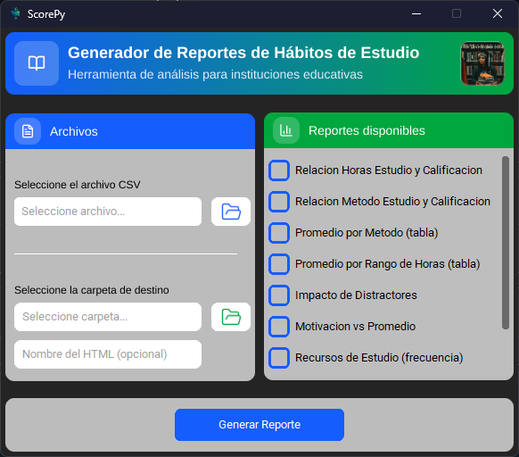
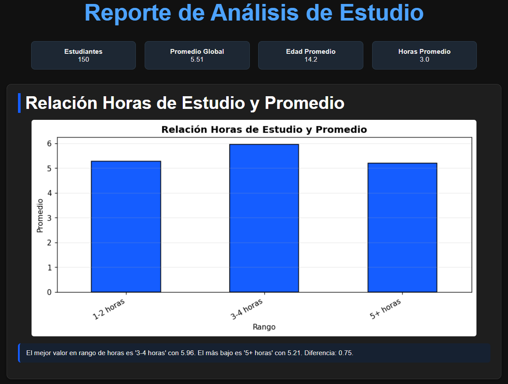
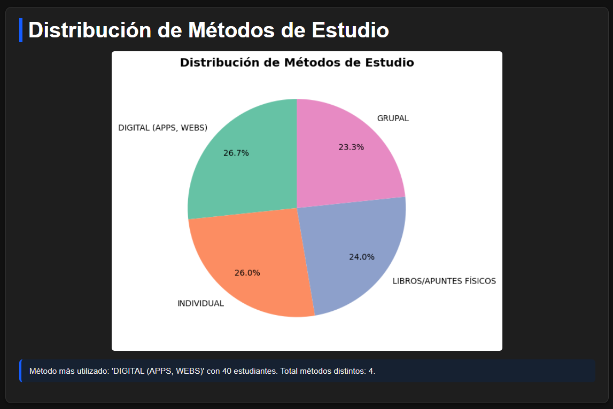
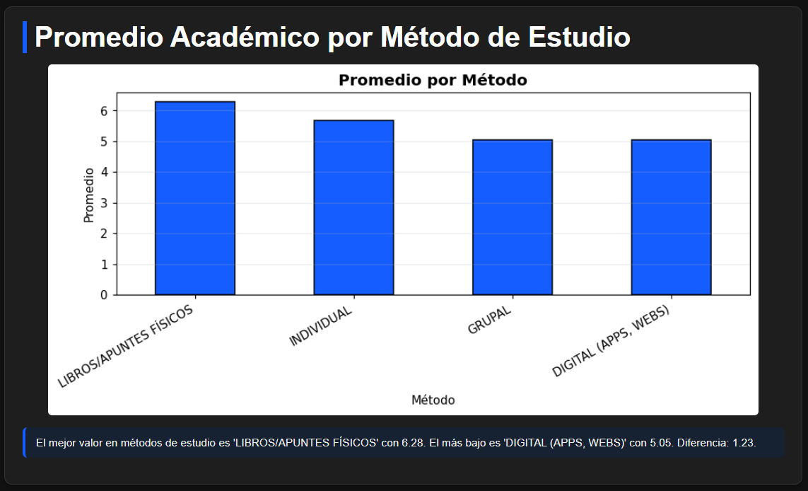
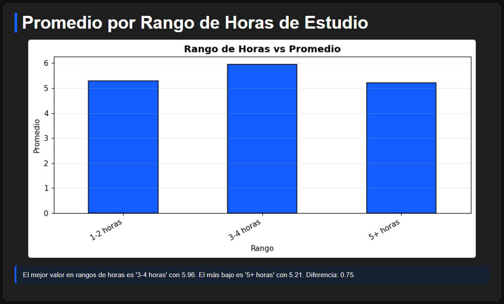
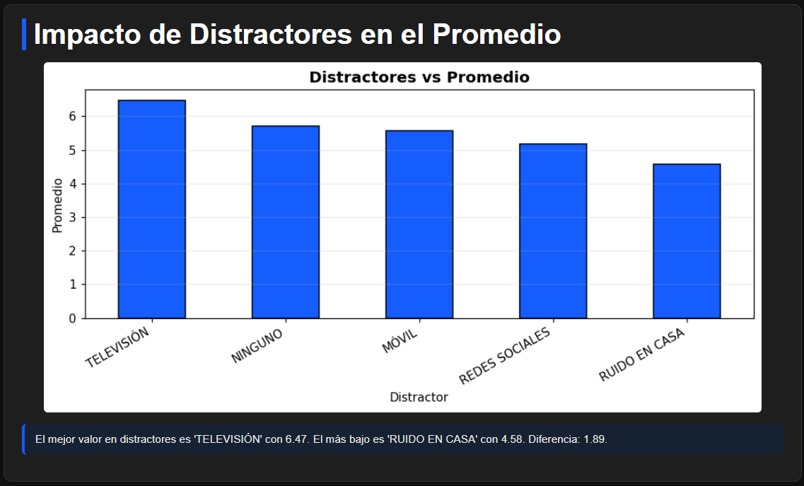

<div align="center">

# ScorePy
#### Herramienta de Análisis Educativo

<picture>
  <source media="(prefers-color-scheme: dark)" srcset="assets/scorepydark.jpeg" />
  <source media="(prefers-color-scheme: light)" srcset="assets/scorepylight.jpg" />
  
</picture>

---

[](https://www.python.org/downloads)
[](LICENSE)
[]()

</div>


## Introducción
ScorePy es una herramientas codificada en python enfocada al análisis de datos del rendimiento estudiantil a base de los habitos y metodos de estudio.


Esta herramienta posee una serie de analisis predeterminados a base de un formulario, con la opcion de seleccionar los analisis requeridos por el cliente, dentro de los tipos de analisis tenemos:
- Relación horas de estudio y calificación
- Relación metodo de estudio y calificación
- Promedio por metodo de estudio
- Promedio por rango de horas de estudio
- Impacto de distracciones en calificación
- Relación motivación vs Promedio
- Recursos de Estudio mas utilizados
- Frecuencia de repasos por semana
- Sentimiento del estudiante en base a promedio
> Debajo de cada reporte se genera un comentario indicando el elemento con mayor valor
---

## Estrcuctura del repositorio

```
ScorePy/
│
├── 📂 src/
│   ├── analisis_datos.py
│   ├── generar_html.py
│   ├── graficos.py
│   ├── interfaz.py
│   ├── procesamiento.py
│   └── img/
│       ├── archivos.png
│       ├── destino.png
│       ├── footer.png
│       ├── header.png
│       ├── reportes.png
│       └── svg.png
│
├── main.py
├── requirements.txt
├── python.ico
└── README.md
```
---

## Instalación

```bash
git clone https://github.com/miwelo/Analisis-Educativo.git
cd Analisis-Educativo
pip install -r requirements.txt
python main.py
```

---

## Demo












