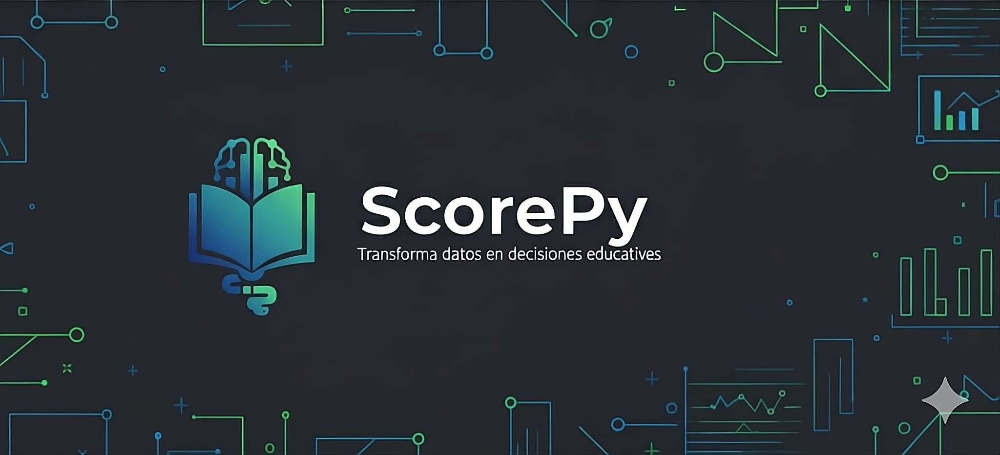

# ScorePy
#### Herramienta de Análisis Educativo

<picture>
  <source media="(prefers-color-scheme: dark)" srcset="assets/scorepydark.jpeg" />
  <source media="(prefers-color-scheme: light)" srcset="assets/scorepylight.jpg" />
  
</picture>

 

